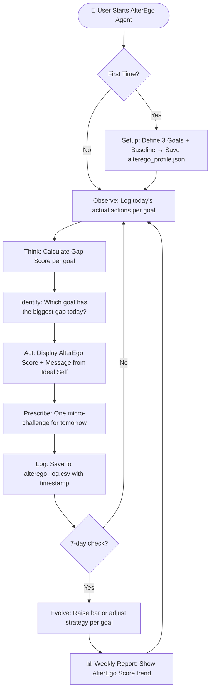

# 🎭 AlterEgo Agent
> *"Because the best version of you already exists. You just haven't met them yet."*

---

## 1. Project Name
**AlterEgo Agent**
"Because the best version of you already exists. You just haven't met them yet."
---

## 2. Real-World Problem
Most people know what they *should* be doing — sleeping better, studying more, eating well — but lack a system that holds them accountable intelligently.

AlterEgo Agent creates a **digital simulation of your ideal self** based on your own goals. Every day it compares your actual behavior against your ideal self, scores the gap, and prescribes one precise action to close it. Over weeks, it evolves as you grow — making it the first AI agent that gets smarter about you, the more you use it.

---

## 3. Implementation Plan

1. **Setup** — User defines 3 core life goals (e.g., "Study 3hrs/day", "Sleep by midnight", "Exercise 4x/week") and rates their current baseline (1–10). This creates the AlterEgo Profile saved in `alterego_profile.json`
2. **Observe** — Each day, the agent asks: "What did you actually do today?" User logs real actions against each goal (e.g., "Studied 1hr, slept at 2AM, skipped gym")
3. **Think** — Agent calculates a Gap Score per goal:

            Gap = (Ideal Target − Actual Performance) × Goal Weight
            Identifies the weakest goal of the day
   
4. **Act** — Outputs:
 
       Today's AlterEgo Score (0–100)
       A message from your "ideal self" (e.g., "Your AlterEgo slept on time. You didn't. Close the gap.")
       One specific micro-challenge for tomorrow
   
5. **Evolve** — Every 7 days, agent raises the bar or adjusts strategy based on trends

        If you consistently hit a goal → it raises the bar automatically
        If you consistently miss a goal → it adjusts strategy, not just repeats the same advice
   
6. **Log** — All data saved to `alterego_log.csv` with timestamps. After 30 days, generates a growth report showing your AlterEgo Score trend over time.

**Tech Stack:** Python | `json` `csv` `datetime` `os` `statistics`

---

## 4. System Diagram

